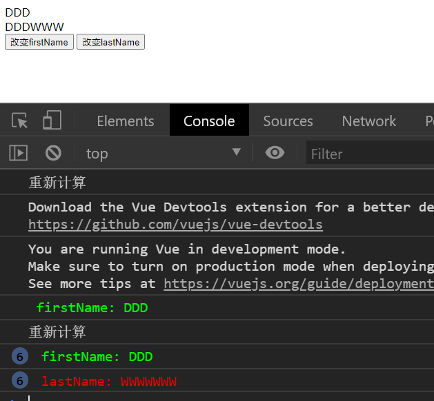
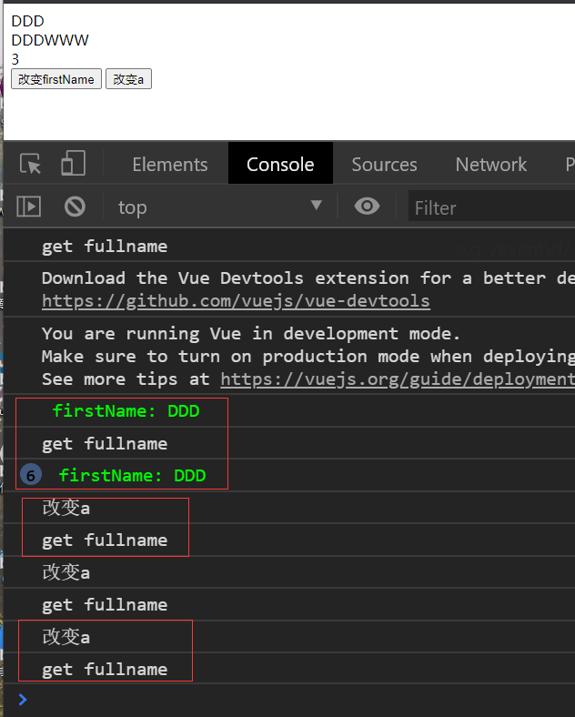

---
{
  "title": "计算属性与侦听器",
}
---

# 计算属性与侦听器

## 计算属性Computed

计算属性是通过监听依赖值的变化，从而动态返回值。有以下几个特点:

- 只有响应式的依赖改变了，才会触发重新计算
- 依赖不变的情况下，会直接返回上一次的计算结果

看个例子:

```html
  <div id="app">
    <div>{{ firstName }}</div>
    <div>{{ fullName }}</div>
    <button @click="change">改变firstName</button>
    <button @click="change1">改变lastName</button>
  </div>
```

```javascript
  // 省略Vue的引入
  let lastName = 'WWW';
  const vm = new Vue({
    el: '#app',
    data: {
      firstName: 'Deng',
    },
    computed: {
      fullName() {
        console.log('重新计算');
        return this.firstName + lastName;
      }
    },
    methods: {
      change() {
        this.firstName = 'DDD';
        console.log(`%c firstName: ${this.firstName}`, 'color: #00ff00');
      },
      change1() {
        lastName = 'WWWWWWW';
        console.log(`%c lastName: ${lastName}`, 'color: #ff0000');
      }
    },
  });
```



第一次计算`fullName`的值进行渲染，点击改变`firstName`时，由于`firstName`是**响应式依赖**且**发生变化**，在再重新计算一次，
随后再触发`firstName`重新赋值，但没有改变，就不会再重新计算了，这就是使用缓存。  
而我们改变`lastName`时，并不会触发`computed`，因为它不是响应式依赖。

### 计算属性的setter

- 计算属性默认只有getter，但是在必要的时候我们也可以提供一个setter

```javascript
  // 省略Vue的引入
  const vm = new Vue({
    el: '#app',
    data: {
      firstName: 'Deng',
      lastName: 'Wei',
    },
    computed: {
      fullName: {
        get: function() {
          return this.firstName + ' ' + this.lastName;
        },
        set: function(newV) {
          const names = newV.split(' ');
          this.firstName = names[0];
          this.lastName = names[names.length - 1];
          // waning 会无限循环爆栈
          // this.fullName = 'hello';
        }
      }
    },
  });
```

在`setter`中，我们可以对相关依赖项进行修改，但切勿在`setter`中对原变量进行赋值

### 计算属性与方法

- 计算属性与方法区别在于，计算属性只有在依赖的响应式值变化时，才会重新执行，而方法在每次触发重新渲染时都会执行。

```html
  <div id="app">
    <div>{{ firstName }}</div>
    <div>{{ getFullName() }}</div>
    <div>{{ a }}</div>
    <button @click="change">改变firstName</button>
    <button @click="change1">改变a</button>
  </div>
```

```javascript
  // 省略Vue的引入
  let lastName = 'WWW';
  const vm = new Vue({
    el: '#app',
    data: {
      firstName: 'Deng',
      a: 0,
    },
    // computed: {
    //   fullName() {
    //     console.log('重新计算');
    //     return this.firstName + lastName;
    //   }
    // },
    methods: {
      change() {
        this.firstName = 'DDD';
        console.log(`%c firstName: ${this.firstName}`, 'color: #00ff00');
      },
      change1() {
        console.log('改变a');
        this.a++;
      },
      getFullName() {
        console.log('get fullname');
        return this.firstName + lastName;
      }
    },
  });
```

### 计算属性传参

利用**闭包**的特性，让计算属性返回一个函数，我们实际监听的属性就是一个函数，再传值就可以自动执行了

```javascript
computed: {
  closure () {
    return function (a, b, c) {
      /** do something */
      return data
    }
  }
}
```



- 从图中可以看出，每次只要**视图重新渲染**的时候，方法都会重新执行一次

> 我们为什么需要缓存？假设我们有一个性能开销比较大的计算属性 A，它需要遍历一个巨大的数组并做大量的计算。然后我们可能有其他的计算属性依赖于 A。如果没有缓存，我们将不可避免的多次执行 A 的 getter！如果你不希望有缓存，请用方法来替代。

## 侦听属性watch

> 当有一些数据需要随着其他数据变动而变动时，可以使用`watch`对变动的数据进行监听，在回调函数处理其他数据的变动。

那在什么情况下适合使用watch呢

```html
  <div id="app">
    <div>{{ fullName }}</div>
  </div>
```

```javascript
  // 省略Vue的引入
  let lastName = 'WWW';
  const vm = new Vue({
    el: '#app',
    data: {
      firstName: 'Deng',
      lastName: 'Wei',
      fullName: 'Deng Wei',
    },
    watch: {
      firstName: function(newV, oldV) {
        this.fullName = val + ' ' + this.lastName;
      },
      lastName: function(newV, oldV) {
        this.fullName = this.firstName + ' ' + val;
      }
    },
  });
```

上面这种情况，我们通过监听两个变量，实现对`fullName`的改变，相比于`computed`版本的，显得过于累赘。

### 常规用法

```javascript
  // 省略Vue的引入
  const vm = new Vue({
    el: '#app',
    data: {
      a: '123',
      b: {
        c: '345',
      },
      d: 'hello',
      e: 'happy',
    },
    computed: {
      copyD() {
        return this.d + 1;
      }
    },
    watch: {
      // 监听单个属性
      a: function(newV, oldV) {},
      // 监听对象内某个属性
      'b.c': function(newV, oldV) {},
      // 监听computed
      copyD: function(newV, oldV) {},
      // 对象深度监听
      b: {
        handler: function(newV, oldV) {},
        deep: true, // 深度监听
        immediate: true, // 立即执行一次
      },
      // 字符串声明处理函数
      e: 'handleE',
      // 数组声明，会按顺序调用
      e: [
        'handleE',
        function handle2(newV, oldV) {},
        {
          handler: function handle3(newV, oldV) {}
        }
      ]
    },
    methods: {
      handleE() {},
    }
  });
```

## 计算属性与侦听属性的区别

- `computed`取决于依赖值的变化， 依赖值不变时会读取缓存
- `watch`取决于监听的属性值变化，属性值变化就会触发回调
- 此处`属性值`是定义在Vue实例下的属性值
- **计算属性不能执行异步任务**，必须同步执行，异步任务要交给`watch`去做

### 引用官网`watch`实现防抖的例子

```html
<div id="watch-example">
  <p>
    Ask a yes/no question:
    <input v-model="question">
  </p>
  <p>{{ answer }}</p>
</div>

<!-- 因为 AJAX 库和通用工具的生态已经相当丰富，Vue 核心代码没有重复 -->
<!-- 提供这些功能以保持精简。这也可以让你自由选择自己更熟悉的工具。 -->
<script src="https://cdn.jsdelivr.net/npm/axios@0.12.0/dist/axios.min.js"></script>
<script src="https://cdn.jsdelivr.net/npm/lodash@4.13.1/lodash.min.js"></script>
<script>
var watchExampleVM = new Vue({
  el: '#watch-example',
  data: {
    question: '',
    answer: 'I cannot give you an answer until you ask a question!'
  },
  watch: {
    // 如果 `question` 发生改变，这个函数就会运行
    question: function (newQuestion, oldQuestion) {
      this.answer = 'Waiting for you to stop typing...'
      this.debouncedGetAnswer()
    }
  },
  created: function () {
    // `_.debounce` 是一个通过 Lodash 限制操作频率的函数。
    // 在这个例子中，我们希望限制访问 yesno.wtf/api 的频率
    // AJAX 请求直到用户输入完毕才会发出。想要了解更多关于
    // `_.debounce` 函数 (及其近亲 `_.throttle`) 的知识，
    // 请参考：https://lodash.com/docs#debounce
    this.debouncedGetAnswer = _.debounce(this.getAnswer, 500)
  },
  methods: {
    getAnswer: function () {
      if (this.question.indexOf('?') === -1) {
        this.answer = 'Questions usually contain a question mark. ;-)'
        return
      }
      this.answer = 'Thinking...'
      var vm = this
      axios.get('https://yesno.wtf/api')
        .then(function (response) {
          vm.answer = _.capitalize(response.data.answer)
        })
        .catch(function (error) {
          vm.answer = 'Error! Could not reach the API. ' + error
        })
    }
  }
})
</script>
```

对用户的输入值进行监听，但是在用户停止操作一定时间后才会进行异步的请求，在一定程度上优化了性能

## 参考资料

[详解Vue计算属性和侦听属性](https://juejin.im/post/6844903864559206414#heading-9 "掘金")  
[Vue 的计算属性真的会缓存吗？（保姆级教学，原理深入揭秘）](https://juejin.im/post/6844904120290131982#heading-0 "掘金")
