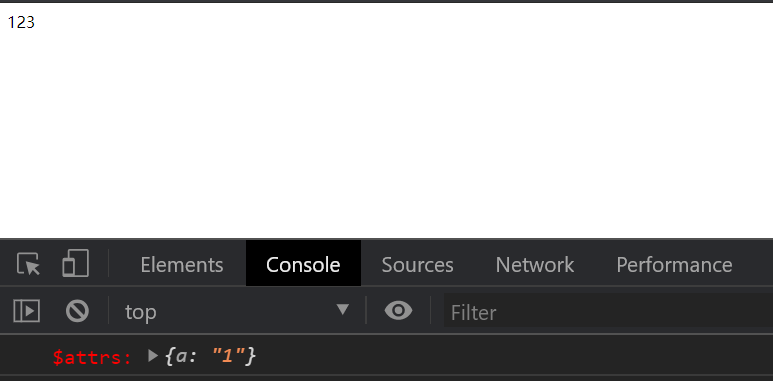

---
{
  "title": "非Prop的组件属性",
}
---

# 非Prop的组件属性

> 一个非 prop 的 attribute 是指传向一个组件，但是该组件并没有相应 prop 定义的 attribute。

```html
<bootstrap-date-input data-date-picker="activated"></bootstrap-date-input>
```

若组件里没有定义`data-date-picker`为`prop`，那么`data-date-picker`属性会自动添加到组件的根元素上。

## 属性的替换与合并

> 对于绝大多数attribute来说，从外部提供给组件的值会替换掉组件内部设置好的值。所以如果传入`type="text"`会替换掉`type="date"`
但是`Class`和`Style`属性会被合并。

## $attrs属性

组件的`$attrs`属性可以获取到所有没有在`props`中定义但传给组件的属性。
示例：

```html
<div id="app">
  <hello-world a="1" test="123"></hello-world>
</div>
```

```javascript
Vue.component('helloWorld', {
  //inheritAttrs: false,
  props: ['test'],
  template: `
    <div>{{ test }}</div>
  `,
  created() {
    console.log('%c $attrs: %o', 'color: #ff0000' ,this.$attrs);
  },
})
// 省略Vue的引入
const vm = new Vue({
  el: '#app',
  data: {},
  methods: {},
});
```




## inheritAttrs属性

通过在组件内设置`inheritAttrs: false`可以阻止`$attr`里面的属性挂载到根元素上。

```javascript
Vue.component('helloWorld', {
  inheritAttrs: false,
  props: ['test'],
  template: `
    <div>{{ test }}</div>
  `,
  created() {
    console.log('%c $attrs: %o', 'color: #ff0000' ,this.$attrs);
  },
})
// 省略Vue的引入
const vm = new Vue({
  el: '#app',
  data: {},
  methods: {},
});
```


通过`inheritAttrs`我们可以自定义将这些属性挂载到特定的元素上

```javascript
Vue.component('base-input', {
  inheritAttrs: false,
  props: ['label', 'value'],
  template: `
    <label>
      {{ label }}
      <input
        v-bind="$attrs"
        v-bind:value="value"
        v-on:input="$emit('input', $event.target.value)"
      >
    </label>
  `
})
```

```html
<base-input
  v-model="username"
  required
  placeholder="Enter your username"
></base-input>
```

::: warning
inheritAttrs属性对`class`和`style`属性不会起作用，`$attr`也无法获取到这两个属性。
:::
